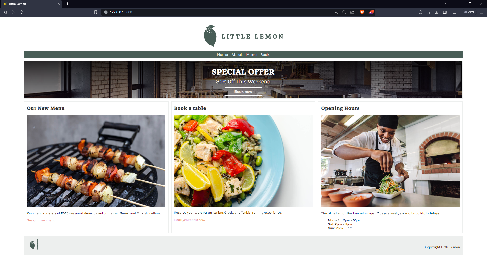
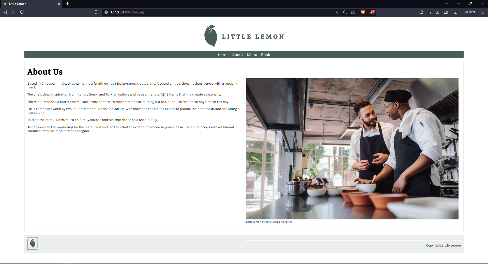
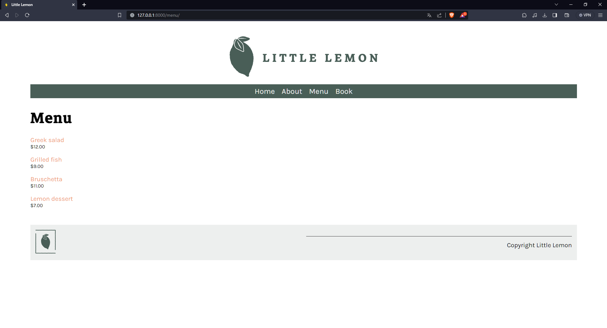
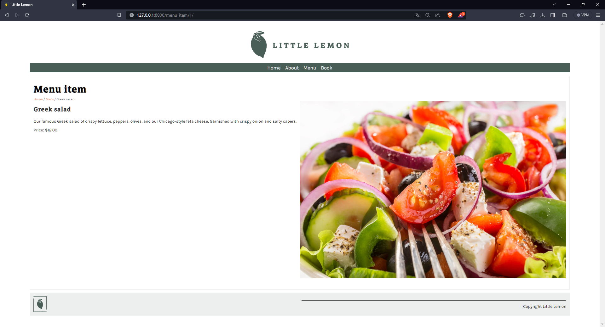
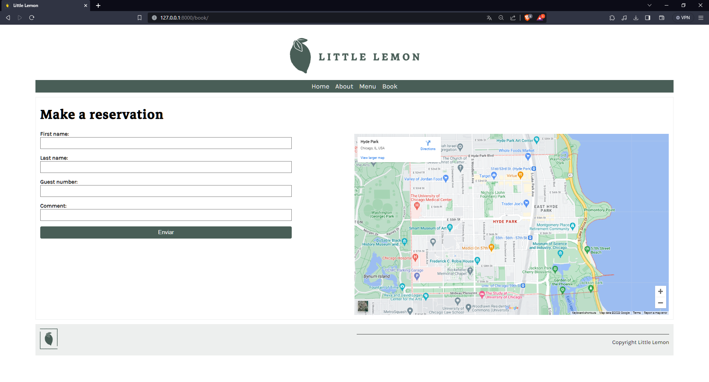

# Django Web Framework App

@ShinjiMC - By Braulio Nayap Maldonado Casilla

## Description of the Project

The "Little Lemon" restaurant web project is designed as an interactive platform catering to the needs of a restaurant business. With a focus on enhancing user experience, it incorporates various views such as Home, About, Menu, and Book. Leveraging Django's framework capabilities, the project utilizes SQLite3 as the underlying database system. Each view serves a distinct purpose: the Home view welcomes users to the restaurant's digital space; the About view provides insights into the restaurant's history, vision, and mission; the Menu view showcases the diverse array of culinary offerings; and the Book view allows patrons to make reservations seamlessly. Through this implementation, the project aims to deliver an engaging and informative online presence for the "Little Lemon" restaurant, facilitating user interaction and providing a convenient platform for customers to explore the restaurant's offerings and make reservations effortlessly.

## Running the Project

### Set up a Virtual Environment

To begin, install `virtualenv` if you haven't already:

```bash
pip install virtualenv
```

Create a new virtual environment:

```bash
python -m venv myenv
```

For Windows:

```bash
./myenv/Scripts/Activate.ps1
```

For Linux:

```bash
source myenv/Scripts/activate
```

### Install Django in the Virtual Environment

Once the virtual environment is activated, install Django:

```bash
pip install django
```

### Running the Project

To run the project, execute:

```bash
python manage.py runserver
```

### Exiting the Virtual Environment

To exit the virtual environment when you're done working on the project:

```bash
deactivate
```

## Structure of the Project

### Home View

The Home view acts as the primary interface, presenting crucial information such as the restaurant's operating hours, menu availability, and a convenient section for making reservations. This section serves as the gateway for visitors, offering a glimpse into the restaurant's offerings and encouraging them to explore further.


### About View

In the About view, patrons can delve deeper into the restaurant's narrative. This section encapsulates the restaurant's history, core values, and additional details that define its uniqueness. It provides a comprehensive overview, allowing visitors to connect with the establishment on a more personal level.


### Menu View

The Menu view showcases the culinary delights available at the Little Lemon restaurant. It displays an assortment of dishes alongside their respective prices, inviting customers to explore the diverse range of flavors and options offered by the establishment.


### Menu Item View

For a more detailed insight into specific dishes, the Menu Item view provides in-depth information about individual menu items. Visitors can access detailed descriptions, images, and additional specifics about each dish, aiding them in making informed dining choices.


### Book View

The Book view streamlines the reservation process, enabling guests to secure their spot at the restaurant hassle-free. It facilitates reservation requests by prompting users to provide their names, specify the party size, preferences, and even offers a convenient visual representation of the restaurant's location through Google Maps.


## Licencia:

Este proyecto está licenciado bajo [Creative Commons Atribución-NoComercial-CompartirIgual 4.0 Internacional](http://creativecommons.org/licenses/by-nc-sa/4.0/):

<a rel="license" href="http://creativecommons.org/licenses/by-nc-sa/4.0/">
  
</a>
